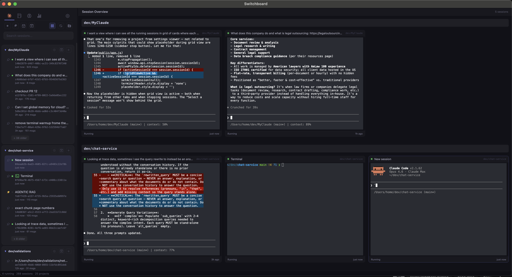
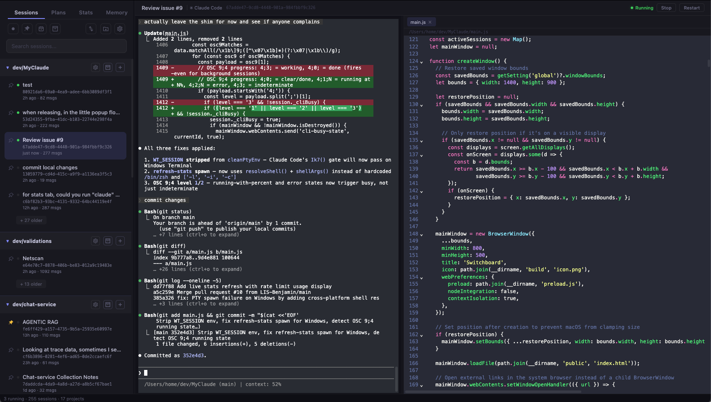
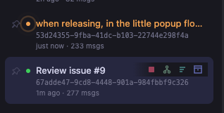

# Switchboard

Your command center for Claude Code sessions.

Switchboard is a desktop app that gives you a unified view of all your Claude Code sessions across every project. Launch, resume, fork, and monitor sessions from a single window — no more juggling terminal tabs or digging through `~/.claude/projects` to find that one conversation from last week.

> ## ⚠️ Read this first — personal fork, no warranty, no liability
>
> This repository (codename **deadeye**) is a **personal, unofficial downstream fork**, maintained for our own use.
>
> - **Built on upstream work** ([Doctly](https://github.com/doctly/switchboard) → [HaydnG](https://github.com/HaydnG/switchboard) → [JeanBaptisteRenard](https://github.com/JeanBaptisteRenard/switchboard)), whose authors deserve the credit for the foundation. **It has since been substantially rewritten.** New here: multi-LLM backends, the tabbed layout, project and session tags, and a rebuilt settings surface. Much of what was already there — the attention inbox, handoff, the grid overview, usage — has been extended rather than replaced. See [What this fork adds](#what-this-fork-adds) and [Credits](#license--credits).
> - **This is not an official product.** It is **not affiliated with, endorsed by, or supported by** Anthropic, Doctly, or any upstream author.
> - **No warranty. No support. No liability.** The software is provided *"as is"* under the MIT license, with **no guarantees of any kind**. You use it **entirely at your own risk**. Neither this fork's maintainer nor the upstream authors are liable for any damage, data loss, security incident, or other consequence arising from its use.
> - **Builds are unsigned.** For anything you care about, **build it yourself from source** and run the code you audited — see [Security & Trust](#security--trust).


### Key Features

- **Session Browser** — All your Claude Code sessions, organized by project, searchable by content
- **Built-in Terminal** — Connect to running sessions or launch new ones without leaving the app, with a choice of seven terminal color themes (Switchboard, Ghostty, Tokyo Night, Catppuccin Mocha, Dracula, Nord, Solarized Dark)
- **Attention Inbox** — A prioritized queue of every session that needs you, with a "Focus next" jump and a keyboard shortcut
- **Native Notifications** — OS notifications, dock/taskbar badge, and a tray icon when an agent needs you — even when Switchboard is in the background
- **Session Health & Handoff** — Flags long/expensive sessions and turns "Handoff Recommended" into a one-click fresh-start with a context packet
- **Flexible Grid Layout** — Resize and drag-reorder the session cards in the grid overview; the layout persists
- **Usage Monitoring** — A status-bar segment per backend that reports a quota (Claude live from the API, Codex out of its own transcript), each selectable, with a durable cache
- **Fork & Resume** — Branch off from any point in a session's history
- **Full-Text Search** — Find any session by what was discussed, not just when it happened
- **IDE Emulation** — Switchboard acts as an IDE for Claude CLI, showing file diffs and opens in a side panel where you can accept, reject, or edit changes before they're applied. Supports both inline and side-by-side diff views. Disable this in Global Settings if you prefer Claude to use your own editor (VS Code, Cursor, etc.)
- **Plans & Memory** — Browse and edit your plan files and each backend's memory/instruction files (CLAUDE.md, AGENTS.md, GEMINI.md) in one place, across every project the app knows — not just Claude's
- **Activity Stats** — Heatmap of your coding activity across all projects
- **Session Names** — Picks up session names from Claude Code's `/rename` command automatically

## What this fork adds

Everything below is what **this fork** (deadeye) adds **on top of the base fork**
([HaydnG](https://github.com/HaydnG/switchboard)). Everything else in this README describes
features **inherited** from upstream — credit for those goes to the upstream authors. Some items
here are ports of other community forks (brianstanley, kreaddis), noted where applicable.

- **Tabbed single-view UI** — Session tabs replace the grid as the primary layout (grid stays as a legacy mode), with a right-click **tab context menu** (Close / Stop / Relaunch), auto-close, and viewer close buttons. The top menubar is removed for a cleaner window.
- **Projects tab** — A dedicated project-management view: add projects manually or automatically, hide/restore projects, rename them, and a per-project `.work-files/` browser (view, delete, JSON/JSONL export).
- **The project list is a list** — Projects are a stored list, not something derived from the transcripts on disk. So a project with **no sessions at all** can be on it (added by hand, and shown), and **hide** and **remove** are finally different things: hide keeps it on the list and unseen; remove takes it off, and a removal *sticks* — the sessions it left behind do not bring it back, but a new one does. Discovery registers a project from **any** backend's store.
- **Sidebar power tools** — Mark projects as favorites, keep an own favorites list, and configure the collapse state on startup. A **View menu** in the sidebar holds the project order (Activity / A–Z / Manual) where the list is, instead of behind a settings dialog: what you pick there applies to *this run of the app only* — Settings stays the source of truth and the fallback, the button carries a dot while your order differs from the saved one, and *Reset to saved* puts it back.
- **Nothing goes missing quietly** — Sessions in projects that are not on your list are indexed and searchable but painted nowhere (that is what manual mode means). A line under the project list now says so — *"4 sessions in 1 project not on your list"* — and opens the project manager filtered to exactly those projects, where one click adds one. It offers only what auto-add would have taken, tombstone included: a project you removed is not offered back until a session newer than the removal turns up.
- **Closing does not silently kill your work** — The window owns every running CLI: when it goes, they go. Closing while sessions are running now asks first, in the app's own dialog, and says what is at stake (how many sessions and terminals, in which projects). Cancel is the reflex answer — Escape and Enter both cancel — and a stray backdrop click is not an answer. Switch it off in *Settings → Sessions & CLI*.
- **Terminal comfort & fixes** — Configurable font, size and zoom (Ctrl+mouse-wheel plus status-bar buttons), paste images/files from the clipboard via Ctrl+V, a right-click behavior dropdown (Menu / Copy or paste / Copy only / Selection bar + paste / Native — the action bar pops a floating Copy/Task toolbar above a text selection, Office-style), a mouse-mode dropdown (Native / Select PowerShell-style / Off — Select keeps native wheel scroll in a TUI while a left-drag selects text locally), an external-terminal + file-explorer launcher, a configurable external editor (open files via Ctrl/Cmd+click a file link, the right-click menu, or the file panel — OS-default fallback), a VSCode-style GPU-rendering mode (Auto / On / Off — Auto auto-falls back to the DOM renderer once the GPU/driver drops a WebGL context; the WebGL context budget is raised to 32 so many open terminals keep GPU rendering), Windows PTYs on node-pty's bundled conpty.dll (Windows Terminal codebase — fixes stale/duplicated rows the in-box ConPTY leaves behind; advanced Bundled/System setting), and a batch of Windows ConPTY rendering fixes.
- **Bookmarks & session tags** — Per-message transcript bookmarks (with a hover gutter to bookmark, copy or turn a message into a task) and colored session tags, persisted in SQLite for fast recall.
- **Tag filter, both kinds, one bar** — Tag projects from the project settings with a chip editor (type + Enter to add, `×` to remove), reuse existing tags via autocomplete, and recolor any tag from a palette or a custom color picker. The chips below the search bar filter the sidebar: **project chips** (a folder glyph) drop whole projects, **session chips** (a `#`) drop session rows. Each kind is an AND match, and the two AND together — *sessions tagged `bug` in projects tagged `kunde`*. The glyph is not decoration: the two namespaces are separate, so the same word can be a project tag **and** a session tag.
- **Subagent-aware status** — Full-screen TUI sessions now report **Working** (a `UserPromptSubmit` hook replaces the OSC-0 title spinner they no longer emit). Running subagents get a live indicator on their nested sidebar item plus an "N running" badge on the parent caret, and the parent's status dot goes two-color while a subagent works — the parent keeps its own status, since with async subagents it keeps generating rather than waiting. Toggle via the *Subagent live status* setting; hide subagents entirely or pick their row layout via the *Show subagents* / *Subagent row layout* settings (shown only for a backend that has subagents).
- **Session lineage** — A session that continued another's work reads as one. Its earlier sessions fold under it behind a *"▶ N earlier"* caret (the same affordance as the subagent nesting), each a full session row you can open, read or act on; a live earlier session stays its own row. The link is backend-neutral — a Claude fork, a Hermes parent, a Pi fork — and a Claude `/clear`, which records no back-link, is inferred. A `/clear` also folds the old session's row onto the new one so the tab follows and the source stops reading as *running* — including with several sessions live in one folder, because the CLI itself reports which terminal cleared (a per-spawn hook), rather than a heuristic guessing at it. See [spec 13](docs/specs/13-session-lineage.md).
- **Task / note system** — Scoped tasks (project, session, or a specific transcript message) with status (open / in progress / done / dropped), notes and a captured quote. Create one from a transcript selection or whole message (block gutter, right-click, or a configurable shortcut) or from the terminal (right-click / shortcut). Jump from a task to its transcript source, or open (and start, if stopped) the live session. Open the list from the project header or per-session from the terminal toolbar; session cards show an open-task count badge and the project icon highlights when a project has open tasks.
- **Saved Variables** — A reusable snippet/template panel with quick-pick, insert-template and a management tab (port of brianstanley's feature); insert into the terminal via the right-click menu or a configurable hotkey (default Ctrl/Cmd+Shift+V). A template can **compose other variables** (`mysql -u {var:user} -p{var:db-pass}`), and a secret reached that way is never inlined as plaintext — it goes through a 0600 temp file the shell reads at exec time, so it stays out of your shell history, your scrollback and the transcript your CLI uploads. The **template editor** previews exactly what will be inserted, with the same code that inserts it: which variable each reference binds to, where a secret is involved, and — since a file reference is a complete shell word that quoting silently breaks — whether yours is about to be. See [spec 12](docs/specs/12-saved-variables.md).
- **File preview** — The integrated file panel renders Markdown, shows a sandboxed HTML preview (no scripts), and displays images (PNG/JPG/GIF/WebP/SVG…) inline (port of brianstanley's preview panel).
- **Handoff library** — Save handoff packets, edit the prompt before sending, resume from a saved handoff, seed a fresh "New session" directly, and pick the target in the review dialog.
- **Per-session AFK timeout** — Configurable idle handling per session.
- **Token/usage stats** — Per-(session, date, hour, model) token, tool, message and cost metrics collected into the DB.
- **Stats with one backend filter** — *All / Claude / Codex / …* at the top of the Stats page scopes **everything** below it: the contribution heatmap, the 30-day bars, the summary tiles and the per-backend cards. Alongside them: tokens per backend over time (where the work actually goes), token share per model, cost over time, and a weekday × hour grid of when you actually work. Cost is never presented as a bill — an estimate is coloured and labelled as one, and a backend that reports no money gets no chart rather than a row of free days. The rate-limit panel stays unfiltered, because those are Claude's subscription limits and no other CLI has them.
- **Settings overhaul** — Two-column layout, permission modes aligned to the Claude CLI, and an optional pop-out settings window that paints instantly and stays warm between opens. The actions are pinned to the bottom edge and reachable at any scroll position: Hide/Remove Project on the left, then Cancel, **Apply** — save without closing, so you can adjust one category, check it, and move on — and Save. Terminal tools get a page of their own under Terminal.
- **Settings export & import** — *Settings → Maintenance* writes your global settings to a JSON file and reads one back: a backup, or a way to move a configured Switchboard to another machine. An import merges — settings the file does not name keep their current value — and applies at once, without a restart. It goes through the same door a normal save does, so a launcher's `$VAR` env references survive intact and a pasted literal secret still never reaches the disk.
- **Every backend is configurable, and says what it can do** — each CLI declares its own launch options, and the Settings page, the Configure dialog and the template editor are *generated* from that. Pi and Hermes used to offer a single model box while their CLIs took a dozen meaningful switches (`--provider`, `--thinking`, `--tools`, `--toolsets`, `--skills`, `--safe-mode` …); now they offer them. Each option carries a *use the backend's default* box, at **every** level — so a setting you never touched follows the shipped default, including after we improve it, and an option can still be deliberately emptied or switched off. Backends carry their own environment variables too (`$VAR` references, resolved at launch, never written to disk), and a **pre-launch command** (`nvm use 20 &&`, `aws-vault exec profile --`) works for all of them.
- **Templates** — a named set of defaults **for a backend**: *Codex with this model and sandbox*, or *Claude Code pointed at DeepSeek/GLM/OpenRouter*. One mechanism, not two. A template picks the backend it runs on, carries its own options and env bundle, and appears in the launch menu with its own name and badge. Templates are staged like every other setting: created, edited and deleted with **Save Settings**, discarded by Cancel.
- **Claude can be switched off** like any other backend. Its sessions stay visible and searchable — they simply cannot be launched, and its store is no longer scanned. A Codex-only user is a first-class user.
- **Usage & search tweaks** — Status-bar usage as color-threshold progress bars; search with a 3-char minimum and an explicit reindex (Enter / refresh button); the sidebar search also matches project names (display name + path).
- **Multi-LLM backends** — Run **several coding CLIs side by side**: Claude Code, **Codex**, the **Antigravity CLI** (`agy`), **Hermes** and **Pi**, in one sidebar, one search index and one launch menu. Enable a backend in *Settings → Backends*; each gets its own page of launch defaults (generated from that CLI's own options — Claude's permission mode means nothing to Codex), a provider badge in the sidebar, and cost in Stats where the backend reports it (an estimate is labelled as one, never as a bill). Sessions from any backend group into the same project by working directory and are searchable together. Resume keeps a session on its own binary. **Profiles** run the Claude binary against another endpoint (DeepSeek, GLM, OpenRouter…) — keys stay `$VAR` references, resolved at launch, never written to disk. A Claude-only user sees the app unchanged, badges and all. See [`docs/multi-llm.md`](docs/multi-llm.md).
- **Version control on the session cards** — A session's working directory is usually a repo, and now the app says so: a git glyph on every project and worktree header and on the grid cards opens a **changes window** for that repo — the changed files grouped by state (conflicts first), renames as `old → new`, with Open and Reveal. Click a file and its diff expands inline, colored; a large diff (over ~200 lines) offers **Open in window**, which puts it side by side in a CodeMirror view with syntax highlighting. An opt-in badge adds the branch and the change counts next to the glyph. Polling is scoped to what is on screen, never takes git's index lock (so it cannot fight the agent working in that repo), and the whole thing sits behind a neutral provider seam — Mercurial or Subversion would be a new file, not a change to the app. See [spec 15](docs/specs/15-vcs-status.md).
- **Adjustable log level** — A *Sessions & CLI → Log level* setting switches the main-process log verbosity live (error → silly), so a packaged build can be diagnosed without a dev build.
- **About tab** (with build provenance — the branch and short commit a build was made from, plus a `dirty` marker) and a **GitHub-Issues backlog** (issues are the task board, mirrored to `docs/BACKLOG.md`; an `upstream:check` tool detects portable upstream changes).
- **Extra security hardening** — Ported hardening (kreaddis #46) plus dependency audit fixes, on top of the upstream hardening wave.

A per-module breakdown of both the inherited and the fork-specific features lives in
[`docs/fork-features.md`](docs/fork-features.md).

## Session Grid Overview

Open the grid overview via the overview button (or `Cmd/Ctrl+Shift+G`) for a bird's-eye view of all your open sessions at once, grouped by project. In the default tabbed layout the grid is a legacy mode you can switch to at any time.



- **Live terminals** — Every open session renders its full terminal in a card, so you can monitor multiple Claude agents simultaneously.
- **Status at a glance** — Each card shows a status chip (Needs You / Ready / Working / Running / Exited / Idle), an indicator dot, and last-activity timestamp.
- **Status filters** — Filter the grid to All / Needs You / Ready / Running, with live counts.
- **Bulk actions** — Step through the attention queue, mark all ready sessions as seen (with undo), or stop all running sessions (with a confirmation listing what's affected).
- **Auto-open running sessions** — Sessions with a live process surface in the grid automatically by reattaching — never by spawning a new `claude`.
- **Flexible layout** — Resize cards (snap-to-grid spans) and drag to reorder them; the layout persists across restarts. A "reset layout" restores the uniform grid.
- **Click to focus, double-click to expand** — Click a card header to focus it; double-click to switch back to single-terminal view for that session.
- **Persistent** — Grid preference is saved across restarts.

## File Preview Side Panel & Claude IDE MCP Emulator

Switchboard can act as an IDE for your Claude Code sessions. When enabled, Claude's file opens and proposed edits appear in a side panel next to the terminal instead of being sent to an external editor.



- **Diff review** — When Claude proposes a file change, it shows up as a diff in the side panel. You can review the changes and accept or reject them directly.
- **Inline & side-by-side** — Toggle between inline (unified) and side-by-side diff views. Your preference is remembered across sessions.
- **Partial acceptance** — In inline mode, you can accept or reject individual chunks within a diff, then submit the final result.
- **File viewer** — Clickable file links in terminal output (OSC 8 hyperlinks) open in the side panel with syntax highlighting.

To disable IDE emulation entirely (e.g. if you want Claude to use VS Code or Cursor instead), uncheck **IDE Emulation** in **Global Settings**. This stops Switchboard from registering as an IDE, so Claude CLI will discover and connect to your real editor. Changes take effect on new sessions — running sessions are not affected.

## Status Notifications

Switchboard monitors all your sessions in the background and shows status indicators in the sidebar so you can tell at a glance which sessions need attention — even when you're working in a different one.



- **Waiting for input** — A session that needs your response is highlighted so you don't miss it.
- **Permission approval** — When Claude is blocked waiting for a permission grant, the session badge lets you know immediately.
- **Activity indicators** — See which sessions are actively running, idle, or finished.

### Notify me even when I look away

The attention signal follows you out of the app window:

- **Native OS notifications** when a session needs you while Switchboard is unfocused — click one to focus the window and that session.
- **Dock / taskbar badge** showing how many sessions are in the inbox, and a **tray icon** with a summary tooltip and quick menu (Open / Focus next attention / Quit).
- **Coalesced & throttled** — five agents finishing at once become one "3 sessions need you", not five toasts.
- **Hotkey** (default `Cmd/Ctrl+Shift+A`) to jump to the next session needing attention, and an optional **alert sound** on a new "Needs You".
- **Reliable detection** via Claude Code hooks (catches permission/tool prompts the terminal heuristic misses), with the original heuristic as a fallback. Opt-in in Global Settings.

Toggle notifications, sound, and notify-on-Ready in **Global Settings**.

## Agent Supervision

Switchboard treats your sessions like an agent control room — surfacing not just *that* a session changed, but what it's doing and whether it's getting expensive.

- **Attention inbox** — A prioritized list of every session needing you, with a "Focus next" button to cycle through them. Pinned to the top of the sidebar by default, so it stays visible while you scroll (toggle in Notifications).
- **Session health** — Each session is rated Healthy → Growing → Marathon Risk → Handoff Recommended based on turns, transcript size, active time, and cache-read tokens — showing exactly which thresholds it crossed.
- **One-click handoff** — When a session gets long/expensive, a guided flow asks the agent for a handoff packet, starts a fresh lean session seeded with it, and switches to it. Every token-spending step is explicit.
- **"While you were away"** — Returning to a session shows a dismissible summary of what happened and which files it touched since you last looked.
- **Per-session timeline** — A searchable event log (started, busy, needs-you, ready, exited, stopped, forked) separate from raw scrollback.
- **Usage monitoring** — One status-bar segment per backend that reports a quota, each with its own badge and selectable in *Settings → Usage & Notifications*. Claude is fetched live from the API; Codex is read out of its own transcript (no network call, no credentials) and is therefore dimmed and timestamped once the figure goes cold. A backend you have switched off is never asked. Durable cache: a failed poll shows the last good reading, marked stale.
- **Spring cleaning** — Bulk-clear stale and "abandoned short" sessions (conservative bounds; never touches starred, archived, or live sessions).
- **Safer controls** — App-styled confirmation dialogs for destructive actions, with affected counts/names and an undo path where supported.

## Editor

| Shortcut | Action |
|----------|--------|
| `Cmd+F` / `Ctrl+F` | Find in file (also works in terminal) |
| `Cmd+G` / `Ctrl+G` | Go to line |
| `Cmd+Shift+A` / `Ctrl+Shift+A` | Focus next session needing attention |
| `Cmd+Shift+G` / `Ctrl+Shift+G` | Toggle grid overview |
| `Cmd+Shift+M` / `Ctrl+Shift+M` | Move mode on the focused grid card — arrows reorder, `Shift`+arrows resize, `Esc` leaves |
| `Cmd+Shift+,` / `Ctrl+Shift+,` and `.` | Back / forward through the sessions you visited |

## Security & Trust

These fork builds are **unsigned** and are **not audited, reviewed, or vouched for by anyone**.
For anything you care about, **build it yourself from source** rather than trusting a prebuilt
binary from a third party:

```bash
git clone https://github.com/deadeye636/switchboard.git
cd switchboard
npm install
npm run build   # or build:win / build:mac / build:linux
```

That way you run exactly the code you can read and audit, with no trust placed in an opaque
artifact. Any prebuilt release is **convenience-only** — see the disclaimer at the top of this
README: no warranty, no liability, use at your own risk.

## Download

Prebuilt (unsigned) releases for your platform — **convenience only**, prefer building from
source (see [Security & Trust](#security--trust)):

**[Download Switchboard](https://github.com/deadeye636/switchboard/releases/latest)**

- **macOS**: `.dmg` (Apple Silicon & Intel)
- **Windows**: `.exe` installer
- **Linux**: `.AppImage`, `.deb`, or `.pacman` (Arch/Manjaro)

### macOS: first launch (unsigned build)

These builds are **not code-signed or notarized by Apple**, so macOS Gatekeeper will block the app on first launch ("Switchboard is damaged" / "cannot be opened because the developer cannot be verified"). This is expected — to approve it:

1. Move **Switchboard.app** to `/Applications` and double-click it once (it will be blocked).
2. Open **System Settings → Privacy & Security**, scroll to the **Security** section, and click **Open Anyway** next to the Switchboard message.
3. Confirm **Open** in the dialog. You only need to do this once.

If it still won't open, clear the quarantine attribute from a terminal:

```bash
xattr -dr com.apple.quarantine /Applications/Switchboard.app
```

> **This fork has no auto-updates** (the updater was removed — see [Auto-Updates](#auto-updates)). Download newer releases manually and re-run the approval step above.

## Prerequisites

- **Node.js** 20+
- **npm** 10+
- Platform build tools for native modules:
  - **macOS**: Xcode Command Line Tools (`xcode-select --install`)
  - **Linux**: `build-essential`, `python3` (`sudo apt install build-essential python3`)
  - **Windows**: Visual Studio Build Tools — see [`docs/build-windows.md`](docs/build-windows.md) for the current toolchain notes (node-gyp override, node-pty patch)

## Development Setup

```bash
# Install dependencies (runs postinstall automatically)
npm install

# Start the app
npm start
```

`npm start` bundles CodeMirror and launches Electron. For faster iteration after the first run:

```bash
npm run electron
```

## Building

All build commands bundle CodeMirror first, then invoke electron-builder.

```bash
# Current platform
npm run build

# Platform-specific
npm run build:mac     # DMG + zip (arm64 + x64)
npm run build:win     # NSIS installer (x64)
npm run build:linux   # AppImage + deb + pacman (host arch; arm64 is built in CI)
```

Output goes to `dist/`.

### Building on Arch / Manjaro

The `deb` and `pacman` targets are built via the `fpm` binary bundled by
electron-builder, which links against `libcrypt.so.1`. Arch ships `libxcrypt`
without that legacy ABI, so install the compat shim once:

```bash
sudo pacman -S libxcrypt-compat
```

`AppImage` builds without it.

The pacman package is published as **`switchboard-doctly`** rather than
`switchboard` because the Arch `extra` repo already ships a package named
`switchboard` (elementary OS's Pantheon Control Center). Renaming avoids the
file-conflict that would block installation alongside it. The app itself is
still called Switchboard everywhere users see it — only the package identity
changes. Uninstall later with `sudo pacman -R switchboard-doctly`.

## Releasing

Releases are driven by git tags:

```bash
git tag v0.1.0
git push origin v0.1.0
```

The GitHub Actions workflow builds for all platforms and publishes a **draft** release to GitHub Releases (publish it manually). You can also release locally:

```bash
npm run release   # builds + publishes to GitHub Releases
```

Set `GH_TOKEN` in your environment (a GitHub personal access token with `repo` scope).

## Auto-Updates

This fork has **no auto-update mechanism** — the upstream `electron-updater` integration was removed on purpose (unsigned builds can't verify update signatures, and we prefer explicit, user-initiated updates). To update, download the latest release manually and install it over the existing version.

## Code Signing

For distribution, set these environment variables:

- **macOS**: `CSC_LINK` (p12 certificate) and `CSC_KEY_PASSWORD`, or sign via Keychain
- **Windows**: `CSC_LINK` and `CSC_KEY_PASSWORD` for EV/OV code signing
- Set `CSC_IDENTITY_AUTO_DISCOVERY=false` to skip signing (CI artifact builds)

The macOS build uses custom entitlements (`build/entitlements.mac.plist`) to allow JIT and unsigned memory execution, required by native modules (node-pty, better-sqlite3).

## Project Structure

All application code lives under `src/`; the repo root holds only project metadata and tooling.

```
src/
  main.js          Electron main process — a composition root: requires, DATA_DIR, wiring
  preload.js       Context bridge — the only IPC surface
  app/             Main-process areas: lifecycle, windows, notifications, settings,
                   variables (+ secrets), hooks, quit guard, terminal/ (spawn, I/O, PTY logic)
  watch/           File watching: Claude's projects dir, the other backends' stores,
                   identity adoption
  db/              SQLite session cache, metadata, stats & search queries
  index/           Scan/index layer; session-cache.js is a façade over it
  session/         Transcript reading & session identity
  projects/        Project list and management
  servers/         MCP IDE bridge
  backends/        One folder per coding CLI (Claude, Codex, Hermes, Pi, agy)
  workers/         Off-thread scanning, indexing, search
  renderer/        HTML/CSS/JS, in folders (shell/, session/, terminal/, views/, …)
  shared/          The few modules BOTH processes load

test/              Unit tests (node --test) for the pure modules
docs/              Feature docs (see docs/fork-features.md); backlog = GitHub Issues / docs/BACKLOG.md
scripts/           Build & postinstall scripts
build/             Icons, entitlements, builder resources
.github/workflows/ CI/CD
```

## License & Credits

Licensed under the **MIT License** — see [`LICENSE`](LICENSE). MIT includes an explicit
**no-warranty / no-liability** clause; it applies in full to this fork.

**Credits.** Switchboard was created by **[Doctly](https://github.com/doctly/switchboard)** and
substantially extended by **[HaydnG](https://github.com/HaydnG/switchboard)** and
**[JeanBaptisteRenard](https://github.com/JeanBaptisteRenard/switchboard)**. **The foundation is
theirs, and so is the credit for it** — this fork exists because they built the thing worth forking,
and much of what it does today (the attention inbox, handoff, the grid overview, usage)
started with them and was extended here rather than replaced. It has since been substantially
rewritten (deadeye); some of those additions are themselves ports of other community forks
(brianstanley, kreaddis), credited in the commit history.

This fork is **not affiliated with, endorsed by, or supported by** Anthropic, Doctly, or any of the
upstream authors.
