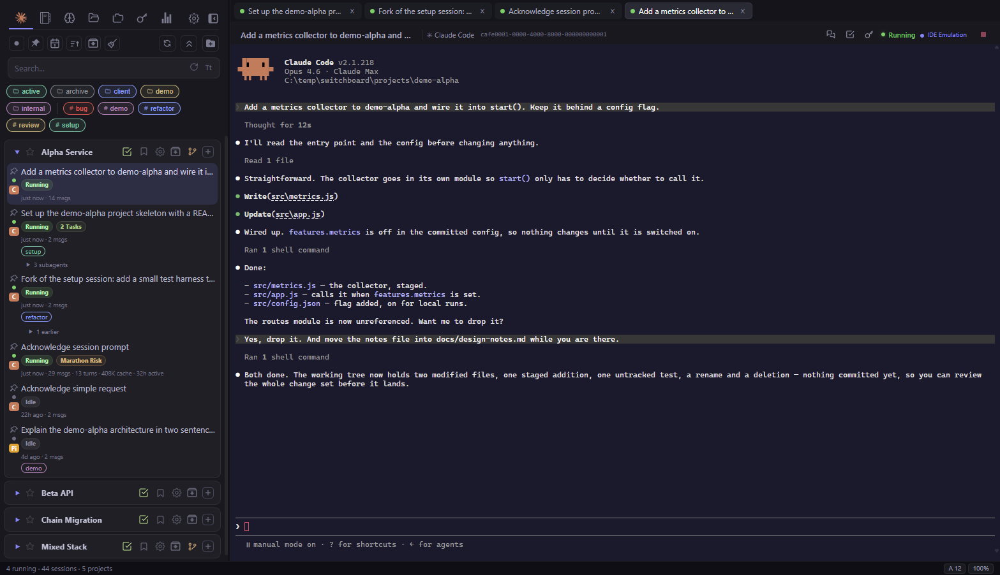
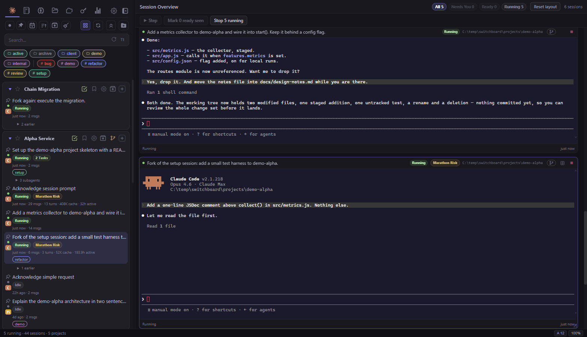
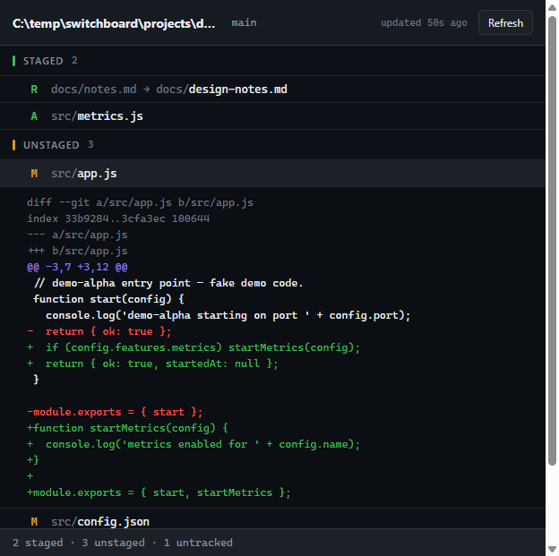
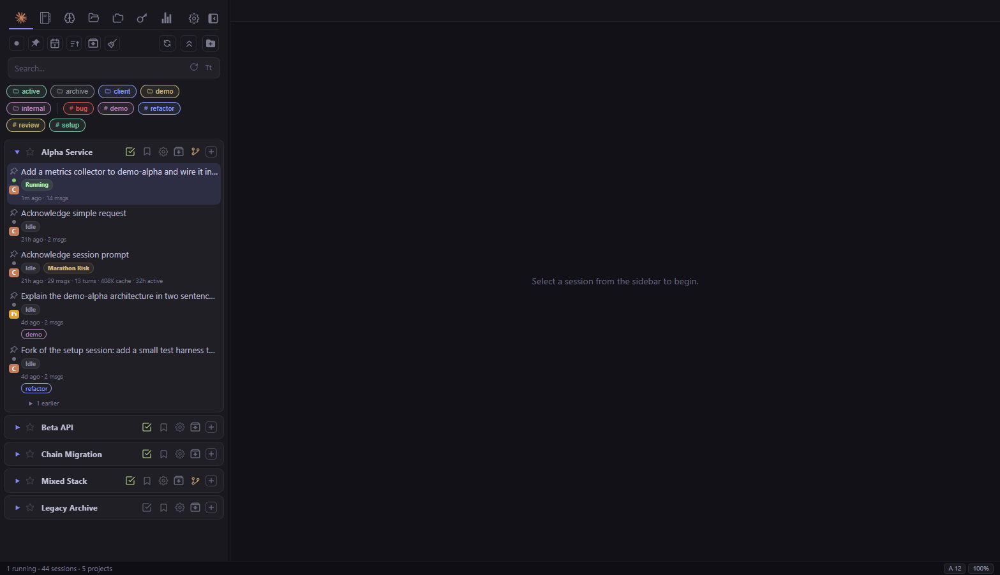
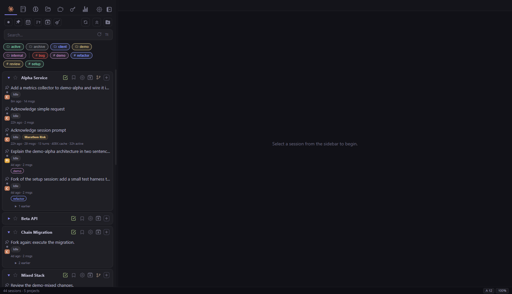
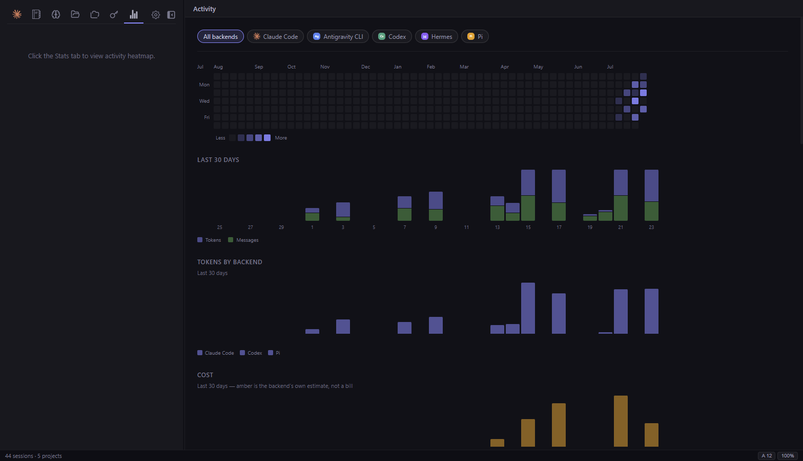
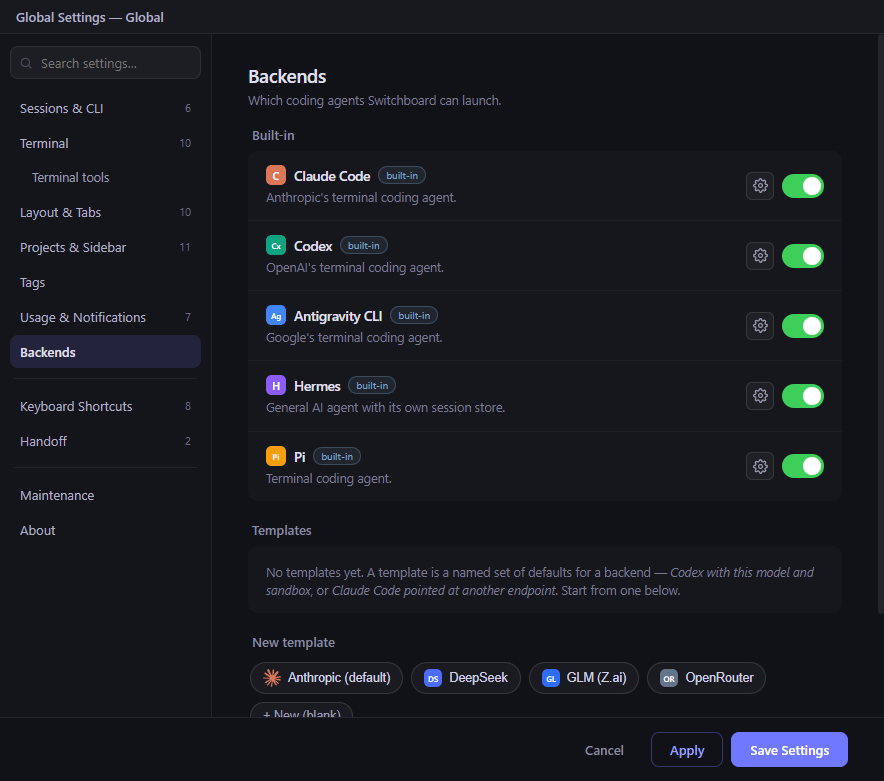

# Switchboard

Your command center for coding-CLI sessions.

Switchboard is a desktop app that gives you one view of every session your coding agents have —
Claude Code, Codex, the Antigravity CLI, Hermes and Pi — across every project. Launch, resume, fork
and monitor them from a single window, instead of juggling terminal tabs and digging through
`~/.claude/projects` for that conversation from last week.

> ## ⚠️ Read this first — personal fork, no warranty, no liability
>
> This repository (codename **deadeye**) is a **personal, unofficial fork**, maintained for our own use.
>
> - **It is built on upstream work** and has since been substantially rewritten. Who built what:
>   [Lineage & credits](#lineage--credits).
> - **This is not an official product.** It is **not affiliated with, endorsed by, or supported by**
>   Anthropic, OpenAI, Google, or any upstream author.
> - **No warranty. No support. No liability.** Provided *"as is"* under the MIT license, with **no
>   guarantees of any kind**. You use it **entirely at your own risk**.
> - **Builds are unsigned.** For anything you care about, **build it yourself from source** and run
>   the code you audited — see [Security & trust](#security--trust).



## What it does

**One sidebar for every agent.** Sessions from all five CLIs group into the same project by working
directory, are searchable together, and each carries a provider badge. Resume keeps a session on its
own binary. A backend you do not use can be switched off entirely — a Codex-only setup is a
first-class setup.

**Sessions as tabs.** The primary layout is tabbed: open sessions sit in a tab strip with a
right-click menu (close, stop, relaunch), and the terminal is live — connect to a running session or
start a new one without leaving the app. Seven terminal themes, configurable font and zoom,
clipboard image paste, GPU rendering with automatic fallback.

**It tells you when an agent needs you.** A prioritized attention inbox, OS notifications, a taskbar
badge and a tray icon — even when the window is in the background. Detection runs off CLI hooks, so
it catches the permission prompts a terminal heuristic misses.

**It notices when a session is getting expensive.** Each one is rated Healthy → Growing → Marathon
Risk → Handoff Recommended from turns, transcript size, active time and cache reads. When it is time,
a guided handoff asks the agent for a context packet, starts a fresh lean session with it, and
switches over.

**Projects are a list you control.** Add them by hand or automatically, hide them, rename them, tag
them. Nothing goes missing quietly: sessions in projects that are not on your list stay indexed and
searchable, and a line under the sidebar says how many there are and offers to add them.

**Your repository, in the app.** A git glyph on every project header opens a changes window: files
grouped by state, renames as `old → new`, click one and its diff expands inline. Polling never takes
git's index lock, so it cannot fight the agent working in that repo.

**Notes that stay attached to where they came from.** Tasks scoped to a project, a session or a
single transcript message, created from a selection or from the terminal, with a captured quote and
a jump back to the source. Plus per-message bookmarks and colored tags on both projects and sessions.

**It knows what you spent.** Per-backend token, message and cost metrics; a contribution heatmap;
tokens per backend over time; a weekday × hour grid of when you actually work. Cost is never
presented as a bill — an estimate is labelled as one, and a backend that reports no money gets no
chart rather than a row of zeroes.

<details>
<summary><b>The full feature list</b></summary>

- **Session browser** — every session, by project, searchable by content, with full-text search
- **Built-in terminal** — attach to a running session or launch a new one; seven color themes
  (Switchboard, Ghostty, Tokyo Night, Catppuccin Mocha, Dracula, Nord, Solarized Dark)
- **Multi-LLM backends** — Claude Code, Codex, Antigravity CLI (`agy`), Hermes and Pi side by side.
  Each declares its own launch options, and the settings UI is generated from that declaration.
  **Profiles** point the Claude binary at another endpoint (DeepSeek, GLM, OpenRouter…); keys stay
  `$VAR` references, resolved at launch, never written to disk. → [`docs/multi-llm.md`](docs/multi-llm.md)
- **Templates** — a named set of defaults for a backend: *Codex with this model and sandbox*, or
  *Claude Code pointed at another endpoint*. Appears in the launch menu with its own badge.
- **Attention inbox** — a prioritized queue of every session needing you, with "focus next" and a hotkey
- **Native notifications** — OS toasts, dock/taskbar badge, tray icon; coalesced and throttled
- **Session health & handoff** — flags long/expensive sessions; one-click fresh start with a context
  packet; a handoff library to save, edit and resume packets
- **Session lineage** — a session that continued another's work reads as one, with the earlier ones
  folded behind a caret. Backend-neutral, and a Claude `/clear` is inferred.
  → [spec 13](docs/specs/13-session-lineage.md)
- **Subagent-aware status** — running subagents get a live indicator, an "N running" badge on the
  parent, and a two-color status dot while one works
- **Fork & resume** — branch off from any point in a session's history
- **Tags on both projects and sessions** — a chip editor with autocomplete and a color palette; the
  filter bar ANDs project chips and session chips, and the two namespaces are separate
- **Tasks & notes** — scoped to a project, session or message; status, notes, captured quote; open-task
  count badges on session cards and the project icon
- **Bookmarks** — per-message transcript bookmarks with a hover gutter
- **Saved variables** — a reusable snippet panel with template composition. A secret reached through a
  template is never inlined as plaintext: it goes through a 0600 temp file the shell reads at exec
  time, so it stays out of your history, your scrollback and the transcript your CLI uploads.
  → [spec 12](docs/specs/12-saved-variables.md)
- **IDE emulation** — Switchboard registers as an IDE for the Claude CLI: file opens and proposed
  edits appear in a side panel with inline or side-by-side diffs, where you accept, reject or edit
  before they are applied. Switch it off to let Claude find your real editor instead.
- **File preview** — Markdown, sandboxed HTML (no scripts), and images inline
- **Version control** — per-repo changes window with inline diffs, an optional branch + counts badge,
  behind a provider seam so another VCS would be a new file, not a change to the app.
  → [spec 15](docs/specs/15-vcs-status.md)
- **Grid overview** — every open session as a live terminal card, resizable and drag-reorderable,
  with status filters and bulk actions
- **Plans & memory** — browse and edit plan files and each backend's memory files (CLAUDE.md,
  AGENTS.md, GEMINI.md) across every project the app knows
- **Stats** — heatmap, per-backend tokens and cost, model share, and a when-you-work grid, all behind
  one backend filter
- **Usage monitoring** — a status-bar segment per backend that reports a quota, with a durable cache
  that shows the last good reading when a poll fails
- **Spring cleaning** — bulk-clear stale and abandoned-short sessions, never touching starred,
  archived or live ones
- **Settings** — two-column layout, an optional pop-out window, Apply without closing, export and
  import to move a configured Switchboard to another machine

</details>

## Session overview

Every open session as a live terminal card, grouped by project — press `Cmd/Ctrl+Shift+G` or use the
overview button. Filter by status, step through the attention queue, or stop everything at once.
Cards can be resized and dragged, and the layout survives a restart.



## Version control



Staged, unstaged and untracked, grouped and counted; a rename as `old → new`; click a file and its
diff expands inline. A diff over ~200 lines offers **Open in window** — side by side in a CodeMirror
view with syntax highlighting.

## Projects



Add projects manually or automatically, hide or remove them (and a removal *sticks* — the sessions it
left behind do not bring it back, but a new one does), rename them, set per-project trust, or delete
one backend's history without touching another's.

## Tasks & notes



A task can hang off a project, a session, or one specific message in a transcript — created from a
selection, a message gutter, or the terminal's right-click menu. It keeps the quote it came from and
jumps back to it.

## Stats



One backend filter at the top scopes everything below it. The rate-limit panel stays unfiltered,
because those are Claude's subscription limits and no other CLI has them.

## Settings



Every backend declares what it can do, and this page is generated from that declaration — Claude's
permission mode means nothing to Codex, and Pi's dozen switches were invisible while it had a single
model box. Each option carries a *use the backend's default* box, so a setting you never touched
follows the shipped default even after that default improves.

## Keyboard

| Shortcut | Action |
|----------|--------|
| `Cmd/Ctrl+F` | Find in file (also works in the terminal) |
| `Cmd/Ctrl+G` | Go to line |
| `Cmd/Ctrl+Shift+A` | Focus the next session needing attention |
| `Cmd/Ctrl+Shift+G` | Toggle the grid overview |
| `Cmd/Ctrl+Shift+V` | Insert a saved variable |
| `Cmd/Ctrl+Shift+M` | Move mode on the focused grid card — arrows reorder, `Shift`+arrows resize |
| `Cmd/Ctrl+Shift+,` / `.` | Back / forward through the sessions you visited |

## Download

Prebuilt (unsigned) releases — **convenience only**, prefer building from source:

**[Download Switchboard](https://github.com/deadeye636/switchboard/releases/latest)**

- **macOS**: `.dmg` (Apple Silicon & Intel)
- **Windows**: `.exe` installer
- **Linux**: `.AppImage`, `.deb`, or `.pacman` (Arch/Manjaro)

There are **no auto-updates** — the upstream updater was removed on purpose, because an unsigned
build cannot verify an update signature. Download a newer release and install it over the old one.

### macOS: first launch

These builds are **not signed or notarized by Apple**, so Gatekeeper blocks the app on first launch
("Switchboard is damaged" / "cannot be opened because the developer cannot be verified"). To approve
it: move **Switchboard.app** to `/Applications`, double-click once (it will be blocked), then open
**System Settings → Privacy & Security**, scroll to **Security**, and click **Open Anyway**. If it
still refuses, clear the quarantine attribute:

```bash
xattr -dr com.apple.quarantine /Applications/Switchboard.app
```

## Security & trust

These builds are **unsigned** and are **not audited, reviewed, or vouched for by anyone**. For
anything you care about, build it yourself rather than trusting a prebuilt binary from a third party:

```bash
git clone https://github.com/deadeye636/switchboard.git
cd switchboard
npm install
npm run build   # or build:win / build:mac / build:linux
```

That way you run exactly the code you can read. Any prebuilt release is **convenience-only** — see
the disclaimer at the top of this README.

## Development

Prerequisites, the demo environment, tests, packaging, releasing and the project structure live in
**[`docs/development.md`](docs/development.md)**.

Other documents worth knowing about:

| Document | What is in it |
|---|---|
| [`docs/development.md`](docs/development.md) | Build, run, test, package, release |
| [`docs/demo-env.md`](docs/demo-env.md) | The isolated demo instance these screenshots come from |
| [`docs/settings-reference.md`](docs/settings-reference.md) | Every setting with its real code default |
| [`docs/multi-llm.md`](docs/multi-llm.md) | How the backends, profiles and templates fit together |
| [`docs/backend-formats.md`](docs/backend-formats.md) | Each CLI's on-disk transcript format |
| [`docs/fork-features.md`](docs/fork-features.md) | Per-module breakdown of what is inherited and what is new here |
| [`docs/specs/`](docs/specs/) | Design records — why a feature is built the way it is |
| [`docs/build-windows.md`](docs/build-windows.md) | The Windows toolchain (node-gyp override, node-pty patch) |

The task board is **GitHub Issues**; [`docs/BACKLOG.md`](docs/BACKLOG.md) is a generated mirror for
grepping.

## Lineage & credits

Switchboard is a fork of a fork. The foundation is upstream work, and the credit for it belongs to
its authors — this fork exists because they built the thing worth forking.

| Repository | Role here |
|---|---|
| [doctly/switchboard](https://github.com/doctly/switchboard) | The original. Everything starts here. |
| [HaydnG/switchboard](https://github.com/HaydnG/switchboard) | The base this fork was taken from — the agent-supervision and productivity waves |
| [JeanBaptisteRenard/switchboard](https://github.com/JeanBaptisteRenard/switchboard) | Feature source |
| [brianstanley](https://github.com/brianstanley/switchboard), [kreaddis](https://github.com/kreaddis/switchboard) | Individual features ported here, credited in the commit history |

Much of what the app does today — the attention inbox, handoff, the grid overview, usage monitoring —
started upstream and was extended here rather than replaced. What is new in this fork (multi-LLM
backends, the tabbed layout, projects as a managed list, tags, tasks, version control, the generated
settings surface) is listed per module in [`docs/fork-features.md`](docs/fork-features.md).

Licensed under the **MIT License** — see [`LICENSE`](LICENSE). MIT includes an explicit
no-warranty / no-liability clause; it applies in full to this fork.

This fork is **not affiliated with, endorsed by, or supported by** Anthropic, OpenAI, Google, Doctly,
or any of the upstream authors.
